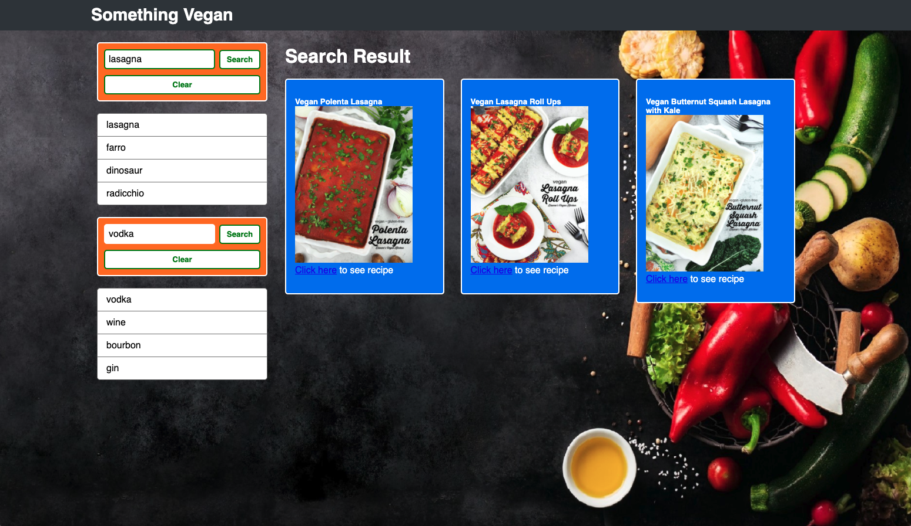

# Something Vegan

Welcome to the README for the seventh project of Coding Boot Camp at UCLA Extension and the first group project of said boot camp: Something Vegan!

## Description

Our seventh project is called Something Vegan: A vegan recipe and cocktail aggregator using HTML, CSS & Bootstrap, vanilla JavaScript and server-side APIs to generate plant-based content for the user. Being vegan is wonderful, but it comes with its own unique frustrations. Combing through cookbooks and the web to find recipes that still have to be modified to be vegan can be a pain. Something Vegan uses server-side APIs to cull only vegan recipes and cocktails from multiple sources for the user, removing the guesswork and frustration from plant-based eating.

## Link

[Something Vegan](https://seanc0ne.github.io/something-vegan/)

## Screenshot

